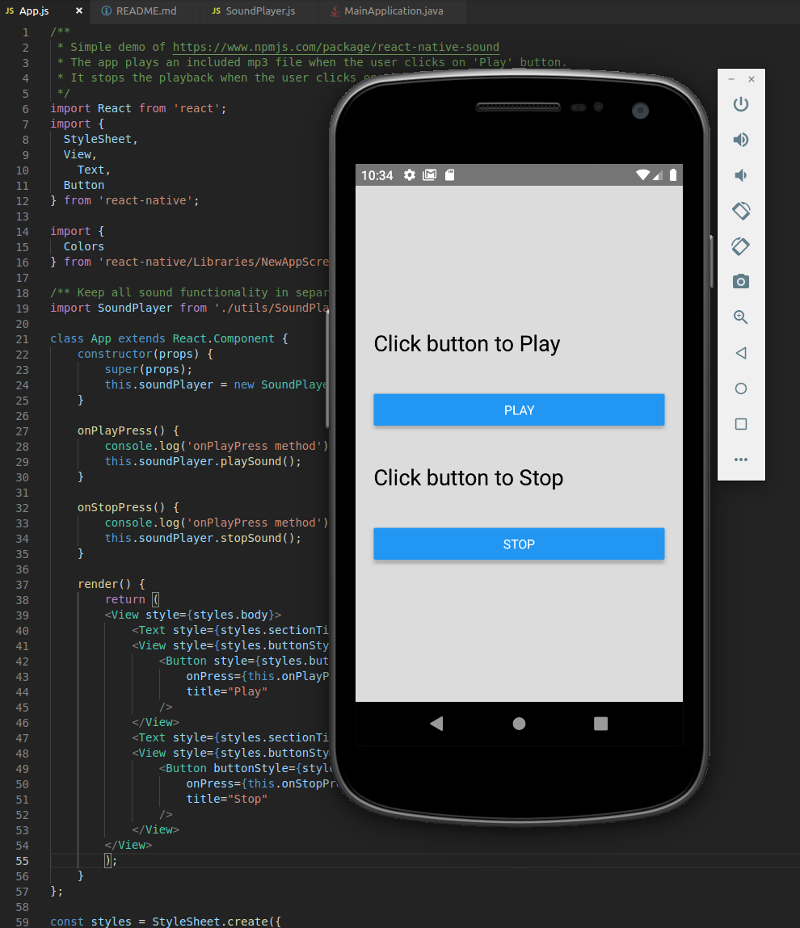

# React Native Audio Player Demo

This React Native app uses the react-native-sound library to play an audio file.

See [https://www.npmjs.com/package/react-native-sound](https://www.npmjs.com/package/react-native-sound)

There was a little trouble getting started. Their documentation says to link the package like this:

```
react-native link react-native-sound
```

I didn't do that, because [supposedly you do not have to in React Native 6 and above](https://github.com/react-native-community/cli/blob/master/docs/autolinking.md).

I wound up getting the `undefined is not an object (evaluating 'RNSound.IsAndroid')` error that they mention in the docs. I was afraid to use the `link` functionality because I don't know what it does :)

I edited the Android files `settings.gradle` and `app/build.gradle` and tinkered around a little bit until it worked.

The current version of this app works to play the embedded audio file.

Here's what the app looks like. It has a very simple view.

